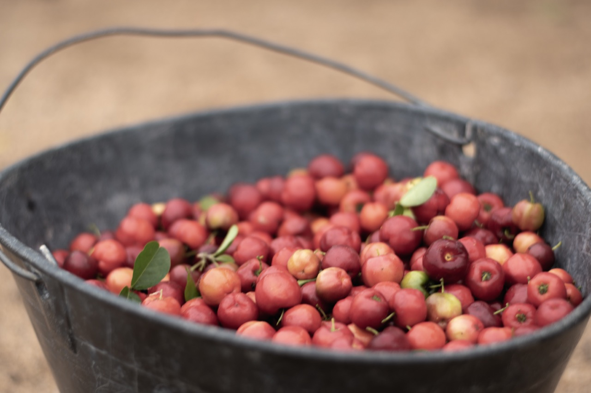
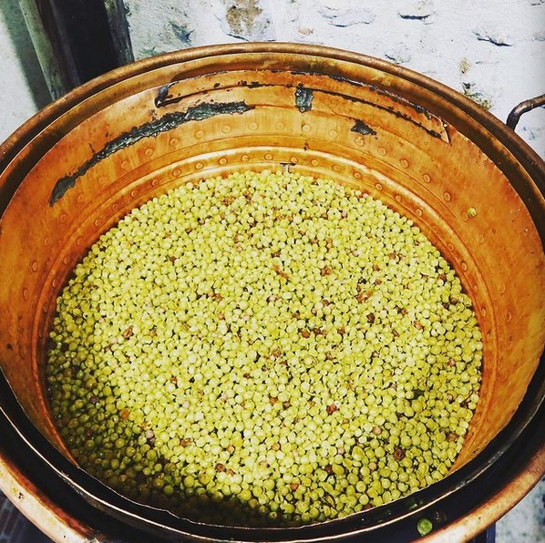
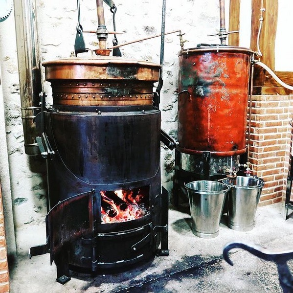
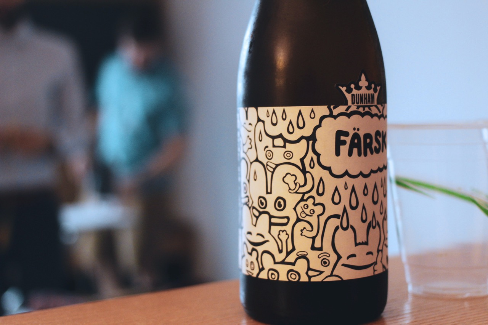

Distiller ma production
========

 

**1/ Je récolte**

Mon Bouilleur Ambulant (B.A) me donne des infos & conseils pratiques pour ma récolte.

 

**2/ Je fermente**

Guidé par mon B.A afin d’apprendre et de comprendre le processus

 

**3/ Distillation par mon bouilleur ambulant**

Je fais distiller par mon B.A. Il m’aide dans la démarche déclarative.

 

**4/ Vieillissement de ma production**

Vieillissement de ma production dans un contenant en bois ou en verre

 

**5/ Dégustation**

 

## Foire aux questions de la distillation

 

**Le distillateur est une profession
agrée par les douanes ?**

*Phasellus in enim eu ante accumsan efficitur vel sed justo. Cras ut feugiat lectus, id placerat felis. *

 

**Le droit de distiller est héréditaire et
réservé à certaines personnes ?**

*Phasellus in enim eu ante accumsan efficitur vel sed justo. Cras ut feugiat lectus, id placerat felis. Donec ornare leo ac lectus *

 

**Les Eaux De Vie issues de la
distillation artisanale d’un Bouilleur
sont de moindres qualités que les
produits industriels ?**

*Phasellus in enim eu ante accumsan efficitur vel sed justo. *
